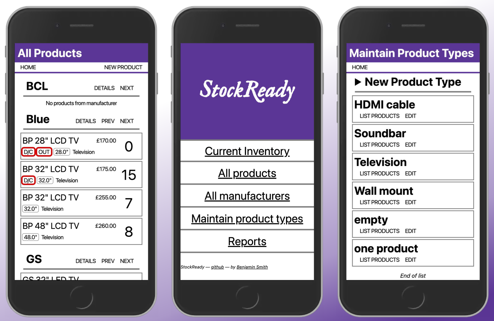

# StockReady

## Codeclan Solo Python/Flask Project

This is a Python project for the [Codeclan](https://www.codeclan.com/) software development course.

The [brief](planning/brief.md) began as: "Build an app which allows a shopkeeper to track their shop's inventory. This is
not an app which the customer will see, it is an admin/management app for the shop workers."

A sample of the project planning documentation is available in the [planning](planning/) directory.



## Running the application

Using a recent version of Python 3, install Flask and psycopg using `requirements.txt`:

```
python3 -m pip install -r requirements.txt
```

Run the tests with `python3 run_tests.py`, or run the Flask application with `flask run`.

Access the app on [http://localhost:4999](http://localhost:4999/).

## Specification

As this is a Codeclan project it had to follow some rules:

The project must be built using only:

* HTML / CSS
* Python
* Flask
* PostgreSQL and psycopg

It must **NOT** use:

* Any Object Relational Mapper (e.g. ActiveRecord)
* JavaScript. At all. Don't even think about it.
* Any pre-built CSS libraries, such as Bootstrap.
* Authentication. Assume that the user already has secure access to the app.

## Development

The project was designed using UX tools such as proto personas, wireframes, site maps and use cases.  The database and classes were planned with diagrams.  Test Driven Development (TDD) was used to implement the business logic in the model.

My favourite part of the experience was attempting to style the app 'mobile first' imagining it being used on a handheld device (eg. Zebra TC52).  I'm particulary proud of writing the SQL necessary to select related products by screen-size.

## Learning Points

A first project always feels like a challenge because it has to be planned and completed from scratch.  I think if I had the chance to continue this project, I'd have liked to include tracking of inventory changes (ie deliveries and sales), and held stock levels in a separate table allowing an extension to multiple shop branches.
