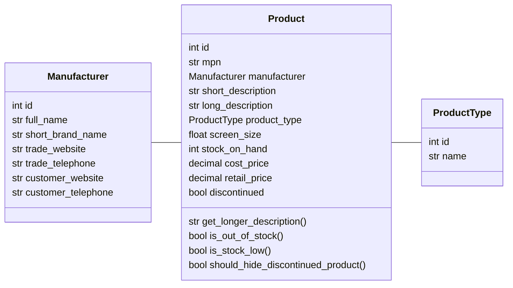

# Class Diagrams

## MVP + Discontinued (Extension 4)

```mermaid
classDiagram
    direction LR
    class Manufacturer {
        int id
        str full_name
        str short_brand_name
        str trade_website
        str trade_telephone
        str customer_website
        str customer_telephone
    }
    class Product {
        int id
        str mpn
        Manufacturer manufacturer
        str short_description
        str long_description
        ProductType product_type
        float screen_size
        int stock_on_hand
        decimal cost_price
        decimal retail_price
        bool discontinued
        str get_longer_description()
        bool is_out_of_stock()
        bool is_stock_low()
        bool should_hide_discontinued_product()
    }
    class ProductType {
        int id
        str name
    }
    
    Manufacturer -- Product
    Product -- ProductType
```
