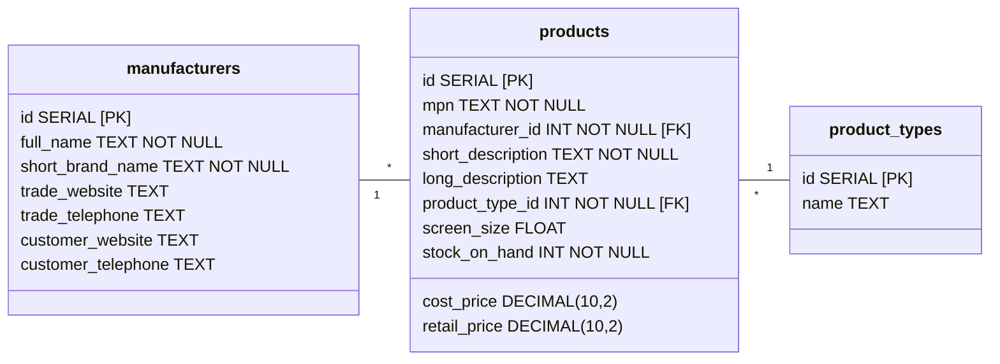
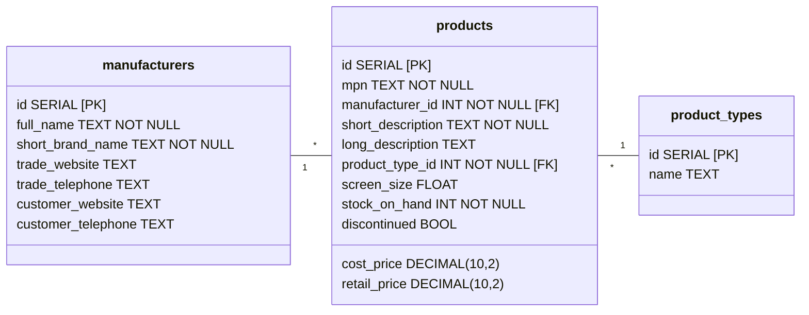
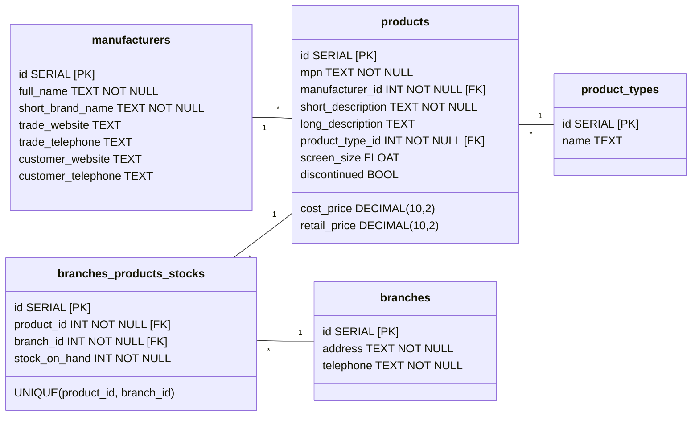

# Database Diagrams

NB. mermaid doesn't support database diagrams so this isn't quite the right format

## MVP

## Active/discontinued products (Extension 4)

## Multiple Branches (Extension 5)

